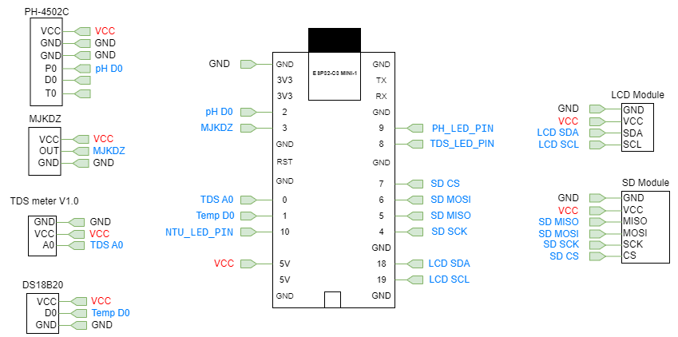
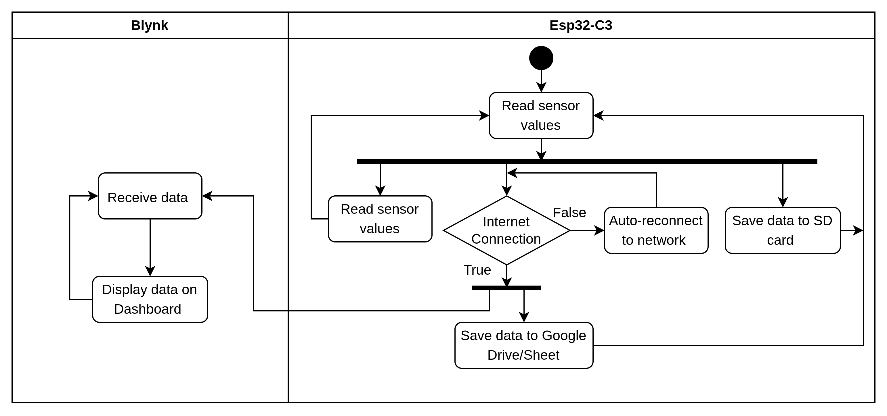
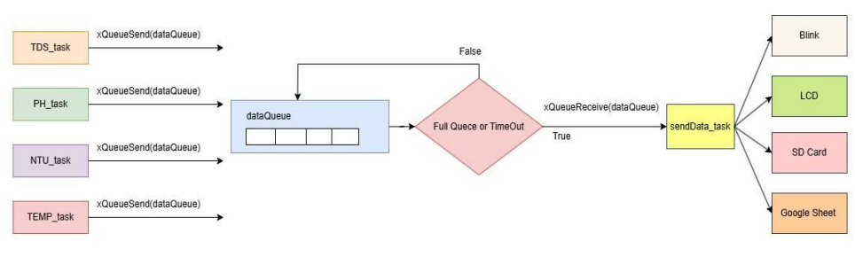
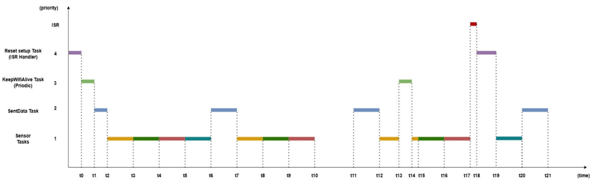
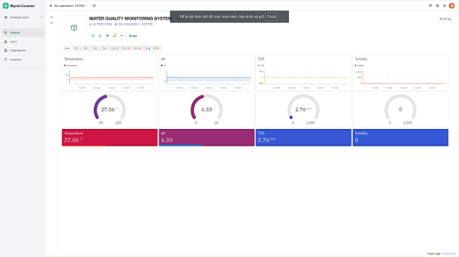
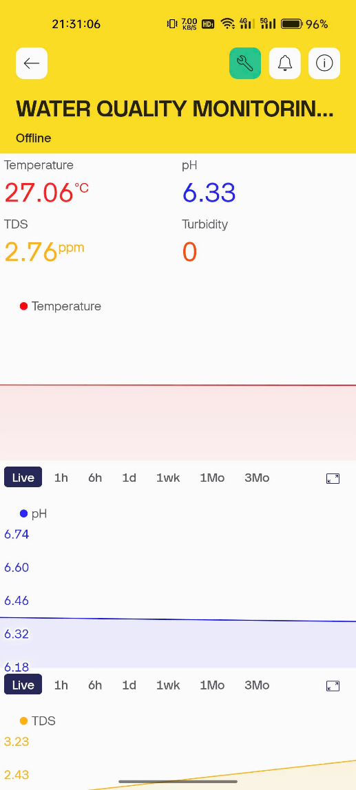

<!-- PROJECT LOGO -->
 

    

  <h2 align="center">PBL 5: Embedded System</h2>
  <h3>Topic: Water Quality Monitoring System</h3>
  

## Schematic Diagram

The domestic water quality monitoring system is designed with hardware featuring the **ESP32-C3 Mini-1** as the central control hub, interfacing with various sensors, an SD memory card, and an LCD screen.

Sensors and peripherals connected to the ESP32-C3 include: 
- pH Sensor (pH-4502C)
- Turbidity Sensor (MJKDZ) 
- TDS Sensor (TDS Meter V1.0) 
- Temperature Sensor (DS18B20) 
- SD Card (SD Module) 
- LCD Screen 

## Activity Diagram
 

Hardware Operation Summary: 

1. The ESP32-C3 reads signals from the sensors via analog pins (pH, NTU, TDS) and digital pins (temperature).
2. Once the sensor data is processed, it is:
- Displayed on the LCD screen using the I2C protocol.
- Displayed on the LCD screen using the I2C protocol.
3. When an Internet connection is established, the data is transmitted to the Blynk application, enabling the user to monitor quality metrics remotely.

## Software Architecture (FreeRTOS)

## User Interface

